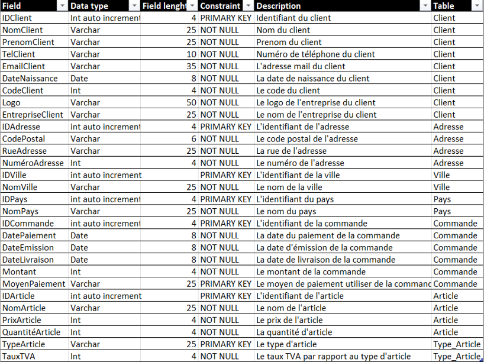

    <h1>
        Programmation orientée objet
    </h1>

# Sommaire

- [Sommaire](#sommaire)
- [Contexte](#contexte)
- [Conception](#conception)
  - [Diagramme de cas d'utilisation](#diagramme-de-cas-dutilisation)
    - [Client](#client)
    - [Commande](#commande)
    - [Produit](#produit)
  - [Diagramme de classe](#diagramme-de-classe)
  - [Diagramme de séquence](#diagramme-de-séquence)
    - [Client](#client-1)
    - [Commande](#commande-1)
    - [Produit](#produit-1)
  - [Diagramme d'activité](#diagramme-dactivité)
  - [Dictionnaire de données](#dictionnaire-de-données)
  - [Diagramme MCD](#diagramme-mcd)
  - [Diagramme MLD](#diagramme-mld)
  - [Schéma de l'interface](#schéma-de-linterface)
- [Captures d'écran](#captures-décran)

# Contexte

Une nouvelle entreprise développe son système d’information. Son cœur d’activité est la vente en ligne de composants électroniques. Elle nous demande alors de concevoir une application permettant de digitaliser certains de ses processus. Avant de passer à la conception de cette application nous devons organiser la structurer même de celle-ci.

# Conception

## Diagramme de cas d'utilisation

### Client

Nous avons plusieurs utilisateurs et nous allons découper le diagramme pour chaque utilisateur afin que ce soit plus lisible.
Tout d’abord nous avons les utilisateurs humains types :
L’employé 1 : qui s’occupe de la gestion des clients
L’employé 2 : qui s’occupe de la gestion des commandes
L’employé 3 : qui s’occupe de la gestion des stocks
Et nous avons aussi l’admin qui aura l’hérédité des trois employés donc qui aura toutes les permissions.

L’employé 1 qui s’occupe de la gestion des clients aura accès à l’interface client, il pourra donc ajouter un nouveau client via son nom et prénom, le supprimer, le modifier ou juste le visualiser. Il aura aussi accès à la visualisation des commandes en relation avec les clients.

### Commande

Nous avons aussi un interacteur non humain qui sera la base de données car toutes les fonctionnalités proposées par les différentes interfaces suivant les utilisateurs et leur niveau de permission vont directement interagir avec la base de données en changeant, ajoutant ou supprimant des données à l’intérieur de celle-ci.

Ici l’employé 2 qui gère les commandes des articles aura accès à toutes les fonctionnalités de l’interface Order ainsi il pourra modifier, supprimer, visualiser ou encore modifier une commande. Il aura aussi accès aux deux autres interfaces mais avec des permissions réduites où il pourra juste visualiser les clients et articles associer aux commandes.

### Produit

L’employé 3 qui gère le stock aura donc toutes les permissions sur l’interface Storage, il pourra alors modifier, supprimer, ajouter et visualiser un article et sa quantité.
Il aura aussi accès à l’interface Order à permission réduite, il ne pourra que visualiser les commandes en rapport avec les articles.

Ainsi comme dit précédemment nous avons l’admin qui hérite des trois employés, il pourra ainsi modifier, supprimer, ajouter et visualiser dans les trois interfaces;

## Diagramme de classe

## Diagramme de séquence

### Client

### Commande

### Produit

## Diagramme d'activité

Les diagrammes d'activité ci-dessus représente la boucle principale et le changement d'onglet parmi les trois existants.
La boucle principale est déclenchée au démarrage du programme. Les changements d'onglet sont déclenchés au clic de l'utilisateurs sur un onglet. On souhaite placer un écouteur d'évènement sur les onglets pour pouvoir charger les données lors du premier affichage d'un onglet.

Le premier diagramme est déclenché par un clic sur le bouton de mise à jour. 
Ce bouton permet de récupérer les dernières données disponibles et de les afficher dans la grille. Si l'utilisateur était en train d'éditer les données, un message de confirmation d'abandon s'affiche.

Le deuxième diagramme est déclenché par un clic sur le bouton d'ajout. Ce bouton permet d'ajouter un nouveau client, Il permet de vider les champs de texte et la grille d'adresses jusqu'alors remplit avec les données d'un autre client. Si ces données étaient en cours d'édition, le programme propose alors d'abandonner les modifications.

Les actions du premier diagramme sont déclenchées lors de la saisie de texte dans la barre de recherche. Le programme va alors filtrer les données disponibles dans la grille client et donc modifier l’affichage de ces données. Les actions du deuxième diagramme sont exécutées lors de l’appui sur le bouton Delete/Cancel. Il y a alors deux possibilités :
- L’utilisateur était en train de modifier un client, une fenêtre est alors affichée pour lui proposer d’abandonner ses modifications. 
- L’utilisateur n’avait pas modifié le client sélectionné. Le programme supprime alors les lignes sélectionnées après une confirmation de la part de l’utilisateur.

Les actions du premier diagramme se déroulent suite à la sélection d’une ligne dans la grille clients et permettent d’afficher les données d’un client dans les champs de texte et dans la grille addresses.

Les actions représentées par le deuxième diagramme sont déclenchées lorsque des données renseignées dans un des champs de texte ou dans une grille de données sont modifiées ou ajoutées. ​ Si les données renseignées sont considérées comme valides, le programme active le bouton de validation, sinon il le désactive.

L’enregistrement des données passe d’abord par une vérification des informations entrées. 

Puis en fonction de l'état actuel du client (déjà enregistré ou nouveau) :
- Dans le cas d'un nouveau client, celui-ci est ajouté à la base de données.
- Dans le cas d'un client existant, les modifications sont appliquées à la base de données

Ensuite, toutes les adresses renseignées sont traitées :
- Dans le cas d'une nouvelle adresse, elle est ajoutée à la base de données avec l'identifiant du client.
- Dans le cas d'une adresse existante, les modifications sont répercutées sur la base de données.

## Dictionnaire de données

Voici les différentes données avec leurs types, leurs tailles, leurs descriptions ainsi que leurs provenances (table où elles sont stockées) qui seront directement implémenter dans le MCD afin de voir les différentes relations entre elles.

## Diagramme MCD

Voici donc le MCD correspondant à la base de données que nous voulons implémenter comprenant les données référencer dans le dictionnaire de données

Nous avons ainsi créé 7 entités (tables) 
- Client
- Adresse
- Commande
- Ville
- Pays
- Article
- TypeArticle 

Nous avons décidé de créer les tables ville, pays et typeArticle afin d’éviter les redondances et de respecter la normalisation car nous pouvons avoir une adresse dans plusieurs de même avec les villes dans les pays

Pour ce qui des cardinalités sur l’association contient nous avons mis 2-2;2-N car la commande doit comprendre l’adresse de facturation et de livraison ainsi deux adresses et la table adresse doit contenir ses deux adresses mais elle peut en contenir plus. Pour ce qui est de celle de comprend nous avons considéré qu’une commande peut contenir un article ou plus et qu’un article peut être dans une ou plusieurs commandes donc 1-N de chaque côté.

## Diagramme MLD

Voici le MLD correspondant au MCD précédent ainsi avec les différentes cardinalités certaine table intermédiaire sont créée notamment l’association comprend qui devient une table.

Nous pouvons aussi voir la distribution des clés étrangère via les cardinalités précédentes comme les deux clés étrangère « IDAdresseFacturation » et « IDAdresseLivraison » qui font référence à la clé primaire « IDAdresse » dans la table « Adresse ».

## Schéma de l'interface

# Captures d'écran

À l'ouverture de l'application, une page de connexion est affichée. Celle-ci est là pour simuler une véritable connexion bien qu'une authentification n'ai pas été implémenté.

L'icône en forme de roue dentée permet d'accéder à une page de configuration de la connexion à la base de donnée.

Si les informations sont incorrectes, un icône ✖️ est affiché à droite du bouton `Test`.

Sinon, un icône ✔️ s'affiche et le bouton `Validate`devient cliquable. 

La page suivante est la page d'accueil.

Gestion des clients :

Gestion du stock : 

Gestion des commandes :

